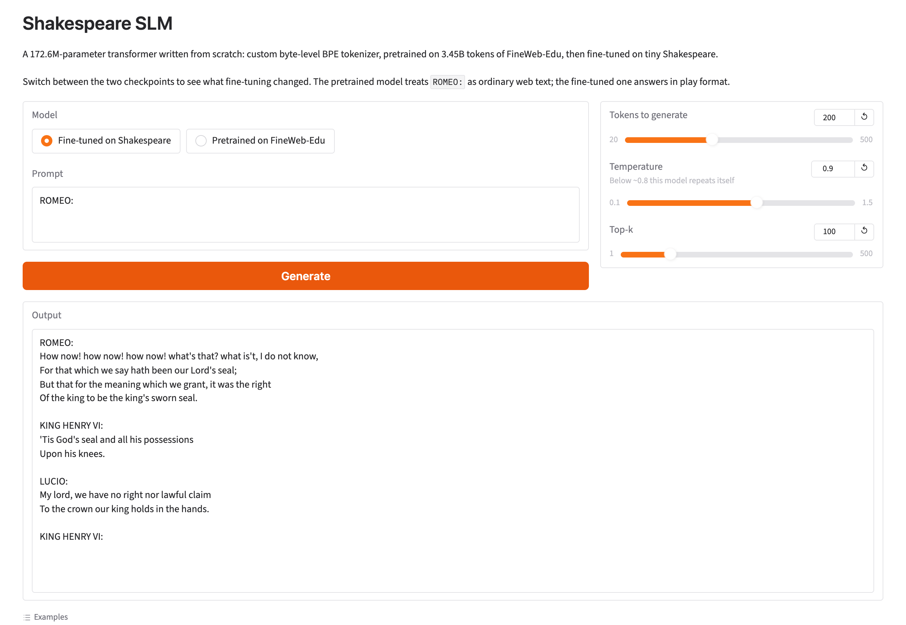

# Pretrain → Fine-tune Shakespeare

An end-to-end small-language-model project built from scratch: a custom
byte-level BPE tokenizer, a hand-written transformer, pretraining on FineWeb-Edu,
fine-tuning on tiny Shakespeare, and a web app to try both. No `transformers`, no
pretrained weights — the only dependency doing heavy lifting is PyTorch.

Weights: **[bahamawama/shakespeare-slm](https://huggingface.co/bahamawama/shakespeare-slm)**

## Demo

A Gradio app (`app/app.py`) serves both checkpoints with a toggle, sampling
controls and token-by-token streaming. Same prompt, same settings — only the
checkpoint differs.

**Fine-tuned on Shakespeare:**



**The same prompt, pretrained model only:**


## Results

A 172.6M-parameter model pretrained on 3.45B tokens of FineWeb-Edu, then
fine-tuned on tiny Shakespeare.

| stage | tokens seen | val loss | perplexity |
|---|---|---|---|
| pretrain (FineWeb-Edu val) | 3.45B | 1.7944 | 6.02 |
| fine-tune (Shakespeare val) | 2.5M | 2.2273 | 9.27 |

Pretrain validation is about **0.98 bits/byte**. The two numbers are measured on
**different corpora** and are not comparable to each other — archaic English on a
tokenizer built for modern web text is a harder target.

The pretraining budget is 20.0 tokens per parameter, the Chinchilla
compute-optimal ratio for this model size, in a single pass with no data repeated.

### What fine-tuning changed

Same prompt, same sampling settings, same app — only the checkpoint differs.

**Pretrained only.** `ROMEO:` carries no special meaning, so the model continues
in the register it was trained on:

```
ROMEO: When I was in college, my main area of interest was in the history of
science and technology. A lot of my research was devoted to micro-scale analysis,
but the big question was how do people want to handle it?
A lot has been written about micro scale analysis, and the big question, in
relation to the big question is how do people want to handle it?
```

**After fine-tuning.** Play structure, alternating speakers, Elizabethan register:

```
ROMEO:
How now! how now! how now! what's that? what is't, I do not know,
For that which we say hath been our Lord's seal;
But that for the meaning which we grant, it was the right
Of the king to be the king's sworn seal.

KING HENRY VI:
'Tis God's seal and all his possessions
Upon his knees.

LUCIO:
My lord, we have no right nor lawful claim
To the crown our king holds in the hands.
```

The pretrained model is a competent web-text continuer on its own ground:

```
The mitochondria produces ATP which then travels to all the cells to which the
cell is attached. Normally the mitochondria are very small in number and have
about 60 cells per gram, the cell wall containing about 40 mitochondria. This
type of process can occur in two ways, through the accumulation of electrons
which then are sent to the nucleus where they can be used for the following
activities.
```

Fluent and on-topic; the biochemistry is wrong. That is the expected shape for a
model this size — syntax and register arrive well before factual reliability.

## Architecture

Decoder-only transformer, defined in `model/transformer.py`.

| | |
|---|---|
| embedding dim | 1024 |
| layers | 12 |
| heads | 16 (head size 64) |
| context | 1024 tokens |
| vocab | 20,000 |
| parameters | 172.6M total, 151.1M non-embedding |

- **Pre-norm** blocks using `RMSNorm`, with a final norm before the LM head.
- **Fused QKV** projection per block, reshaped to `(B, heads, T, head_size)` and
  passed to `scaled_dot_product_attention` with `is_causal=True`.
- **Weight tying** between the token embedding and the output head.
- Init is `normal_(0, 0.02)` throughout, with the output projection of every
  residual branch scaled by `1/sqrt(2 * num_layers)` so the residual stream does
  not compound with depth. This puts initial loss at ~10.1 against a chance level
  of `ln(20000) = 9.90`.
- Learned absolute positional embeddings.
- **KV caching** at inference, so generating a token costs one forward pass over
  the new token rather than over the whole context — 5.4x faster at 200 tokens.

## Repository layout

```
configs/       model, tokenizer, pretrain and finetune hyperparameters (YAML)
data/scripts/  corpus download and tokenization to .bin
model/         the transformer
tokenizer/     byte-level BPE implementation and frozen artifacts
training/      dataset, training loop, pretrain and finetune entry points
inference/     checkpoint loading and sampling
scripts/       generation and export CLIs
app/           Gradio app
notebooks/     end-to-end Colab notebook for the whole pipeline
tests/         tokenizer and data round-trip tests
```

## Setup

```bash
python3 -m venv .venv
source .venv/bin/activate
python -m pip install -r requirements.txt
```

`requirements.txt` does not pin PyTorch — install the build that matches your
platform (Colab and most ML images ship it already).

Both training entry points honour two environment variables so the same code runs
locally and on Colab:

- `PROJECT_ROOT` — repository root (defaults to the location of the script).
- `DATA_DIR` — where the `.bin` files live (defaults to `data/processed`).

## Data

**No corpora are committed.** `data/raw/` and `data/processed/` ship empty; every
dataset is rebuilt from the scripts, so there is never any ambiguity about what
is already present.

```bash
python data/scripts/download_fineweb.py --gb 11 --out data/raw/pretraining-fineweb.txt
python data/scripts/download_shakespeare.py
python data/scripts/prepare_data.py
```

Downloads write to `OUTPUT.part`, finish the current document, flush and fsync,
and are atomically renamed only after reaching the byte target — a failed stream
stays visibly partial. Both scripts refuse to replace completed files; the
FineWeb downloader takes `--force` when replacement is intentional.

Tokenization streams one line at a time, so the multi-GB corpus is never loaded
into memory, and the FineWeb train/val split is moved to the nearest EOT so no
document is cut in half. This yields **3.73B** FineWeb training tokens / 415M val,
and **472k** Shakespeare training tokens / 54k val.

## Tokenizer

Byte-level BPE. IDs 0–255 are raw bytes, ID 256 is the atomic `<|endoftext|>`
token, and learned merges begin at 257. All Unicode is losslessly representable,
no unknown token is needed, and a 20k vocabulary fits in `numpy.uint16`. Measured
compression on FineWeb is **2.65 bytes/token**.

Trained once on a 500MB FineWeb-Edu sample, then frozen:

```bash
python -m tokenizer.train
```

If the artifacts exist, this verifies them and exits without retraining. The
committed `tokenizer/artifacts/` holds `tokenizer_config.json`, `vocab.json`
(token bytes as base64), and `merges.json` (ordered `[left, right, new]` triples).

## Training

```bash
python -m training.pretrain     # FineWeb-Edu
python -m training.finetune     # tiny Shakespeare, from the pretrained weights
```

Both are step-based rather than epoch-based, with gradient accumulation to reach
the target effective batch. On CUDA they enable bf16 autocast, TF32, fused AdamW
and `torch.compile`; elsewhere they fall back to fp32 automatically.

| | pretrain | fine-tune |
|---|---|---|
| steps | 13,150 | 150 |
| micro-batch × accumulation | 32 × 8 | 8 × 2 |
| effective batch | 256 seqs (262k tokens) | 16 seqs (16k tokens) |
| peak LR | 3e-4 | 3e-5 |
| schedule | 500-step warmup, cosine to 5% of peak | 20-step warmup, same |
| token budget | 3.45B (20 tokens/param) | 2.5M (~5 epochs) |
| wall clock (A100) | ~6.5 h at ~48% MFU | ~1 min |

Weight decay applies only to matrices, never to norms, biases, or embeddings.
Gradients are clipped at norm 1.0.

**Checkpointing.** Every `checkpoint_interval` steps the full training state —
model, optimizer, scheduler, step, best validation loss — is written to a rolling
`last.pt` via a temporary file and an atomic rename, so an interrupted write
cannot corrupt it. Both entry points resume automatically if `last.pt` exists.
The trainer also keeps **`best.pt`**, the checkpoint with the lowest validation
loss, which matters for fine-tuning: validation bottoms out around step 130 and
drifts up after, so the last checkpoint is not the best one.

Two caveats worth knowing:

- Do not change `MAX_TRAINING_STEPS` and then resume. The checkpoint restores the
  scheduler's original `T_max`, and `CosineAnnealingLR` is periodic, so the
  learning rate would climb back toward its peak instead of decaying. Delete
  `last.pt` to start a fresh schedule.
- Every evaluation scores the same fixed slice of the validation set. Advancing
  through the val set instead would confound "the model improved" with "this
  slice happened to be easier".

## Generation

```bash
python scripts/generate_sample.py --prompt "ROMEO:" --tokens 200 --temperature 0.9 --top-k 100
```

Options: `--checkpoint` (defaults to the fine-tuned model), `--prompt`,
`--tokens`, `--temperature`, `--top-k`, `--samples`, `--seed`.

**Temperature matters more than you would expect.** This model's output
distribution is sharp, so `--temperature 0.8` samples almost greedily and falls
into repetition loops; 0.9–1.0 reads much better. Measured 4-gram repetition rate
on a 200-token sample: 6.6% at temperature 0.8 versus 0.0% at 1.05, against 0.6%
for real Shakespeare.

With no `--prompt` the model is seeded with `<|endoftext|>`. That token never
appears in the Shakespeare corpus, so the fine-tuned model starts from
out-of-distribution input and tends to open mid-sentence; pass a newline or a
character name instead.

## The app

A Gradio UI with a toggle between the two checkpoints, sliders for sampling
settings, and token-by-token streaming.

```bash
python app/app.py                       # pulls weights from the Hub
MODEL_DIR=/path/to/exports python app/app.py   # or use a local export
```

The app never reads `configs/` — it rebuilds each model from the `config.json`
inside its export bundle, so a bundle is self-contained.

To produce those bundles:

```bash
python scripts/export_model.py --checkpoint checkpoints/finetune/best.pt  --out export
python scripts/export_model.py --checkpoint checkpoints/pretrain/final.pt --out export-pretrained
```

This strips the optimizer state (two thirds of a training checkpoint) and casts
to fp16, taking **2.07 GB → 345 MB**. fp16 is cast back to fp32 at load time on
CPU, where PyTorch's half-precision kernels are slow or missing.

Deployment needs roughly **2 GB of RAM** — 690 MB of fp32 weights, ~100 MB of KV
cache at full context, plus the PyTorch runtime. That rules out most 512 MB free
tiers.

## Colab

`notebooks/shakespeare_slm_colab.ipynb` runs the whole pipeline end to end:
download, tokenize, pretrain, fine-tune, compare, export, publish, serve. The
repo lives on Google Drive so checkpoints survive a disconnect, while the `.bin`
files are copied to Colab's local disk each session — they are memory-mapped with
random access, and reading them through the Drive FUSE layer starves the GPU.

## Tests

```bash
python -m unittest discover -s tests -v
```

These train a tiny in-memory corpus and never touch the network or the large
datasets.

## Known limitations

At 172.6M parameters trained on 3.45B tokens, output is fluent and locally
coherent but not globally sensible. Specifically:

- **Facts are unreliable.** The mitochondria sample above is confidently wrong.
- **Low temperature collapses into loops.** See the Generation section.
- **Character names drift mid-word.** Names are rare multi-token sequences, so
  the model composes them subword by subword and produces blends like
  `DUKE OF MERCUTIO`.
- **Fine-tuning is data-bound, not capacity-bound.** Scaling from 44M to 172.6M
  improved FineWeb perplexity 1.53x but Shakespeare perplexity only 1.21x — 472k
  tokens is the binding constraint there.

## Not yet implemented

`model/config.py`, `training/utils.py`, `training/dataset.py`, and the
`scripts/run_*.py` wrappers are empty placeholders. `TokenDataset` currently
lives inside each training entry point.
